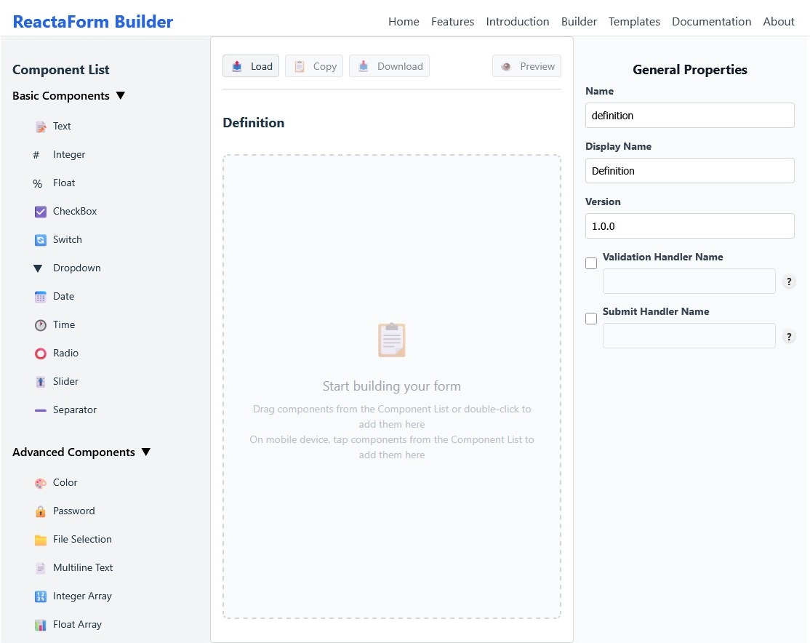

# ReactaForm

> **Build dynamic React forms visually — no JSX, no boilerplate.**

**ReactaForm is a dynamic, schema-driven form platform for React, built for visual workflows.**

Design forms using the drag-and-drop builder or JSON schemas, render them instantly, and scale complex, configurable UIs without rewriting JSX.

✨ Visual Builder included  
✨ TypeScript-first  
✨ Themeable & extensible  
✨ Designed for dynamic, backend-driven UIs

🌐 **Documentation & Demos**  
- https://reactaform.vercel.app  
- **Builder:** https://reactaform.vercel.app/builder

---

## 🤔 Why ReactaForm?

Most React form libraries assume your form structure is **static JSX**.

ReactaForm is built for cases where forms are:
- Generated from backend data
- Configurable at runtime
- Built visually (low-code / no-code)
- Shared across multiple apps
- Highly customizable and themeable

### Comparison

| Feature | React Hook Form | Formik | ReactaForm |
|------|------|------|------|
| JSX required | ✔ | ✔ | ❌ |
| Schema-driven | ❌ | ❌ | ✔ |
| Runtime dynamic forms | ⚠️ | ⚠️ | ✔ |
| Visual form builder | ❌ | ❌ | ✔ |
| Built-in theming | ❌ | ⚠️ | ✔ |
| Plugin architecture | ❌ | ❌ | ✔ |
| Backend-driven UI | ❌ | ❌ | ✔ |

---

## 🏗 ReactaForm Builder

Visual drag-and-drop builder for creating dynamic forms:



## ✨ Key Features

### 🔧 Core
- Schema-driven form rendering
- 20+ built-in field types
- Automatic state management
- Full TypeScript support

### 🛠 Visual Form Builder
- Drag-and-drop form creation
- Live preview
- Validation & conditional logic
- Export production-ready JSON schemas

👉 https://reactaform.vercel.app/builder

### 🎨 Theming
- CSS-variable-based themes
- Light & dark modes
- 20+ built-in themes

### 🧠 Logic & Validation
- Conditional visibility
  Currently parent-child logic and group conditions are supported
- Custom validators
- Custom submission handlers

### 🔌 Extensibility
- Component registry
- Plugin system
- Custom fields and workflows

### 🌍 i18n
- Built-in multi-language support
- Translation caching

### ⚡ Performance & Accessibility
- Debounced input handling
- requestAnimationFrame-based updates
- ARIA-compliant by default

---

## 👥 Who Is ReactaForm For?

- SaaS settings pages
- Admin dashboards
- Product configurators
- CMS-driven forms
- Low-code tools
- Enterprise dynamic UIs

---

## 📦 Installation

```bash
npm install reactaform
```

**Peer Dependencies**
- React ^18 || ^19
- React-DOM ^18 || ^19

---

## 🚀 Quick Start

```tsx
import { ReactaForm } from 'reactaform';

const definition = {
  name: "simpleForm",
  displayName: "Simple Form",
  properties: [
    { name: "email", type: "email", required: true }
  ]
};

export default function App() {
  return <ReactaForm definitionData={definition} />;
}
```

## Conditional visibility
  Dynamically show or hide individual fields or groups based on defined parent–child logic or group conditions.

## Validation and Validators
  ### Validation
    ReactaForm supports both field-level and form-level validation.
    - Field-level    
      Validation per field, can happend at real time (editing field) or at form submission.
    - Form-level
      Validates the form as a whole, enabling cross-field checks. This validation runs during form submission.

  ### Field validation mode
    A prop for ReactaForm to control when to perform field validation
    FieldValidationMode
      - "realTime"    : Runs validation while the user is editing a field.
      - "onSubmission": Runs validation only when the form is submitted.

  ### Validators
    - Field Custom validator
      Validates user-defined logic for individual fields by registering a custom handler.
    - Form Custom Validator 
      Validates user-defined form logic by registering a custom handler, enabling cross-field validation.
    - Field Type Validator
      Defines validation logic for a custom or new field/component type.
---

## 📚 Documentation

👉 https://reactaform.vercel.app/docs

---

## 🗺️ Roadmap

### Core & Standards
- [ ] Accessibility certification (WCAG 2.2 AA)
- [ ] Performance & accessibility audit tooling
- [ ] Schema versioning & migration tools

### Conditional Logic
- [x] Parent–child conditional visibility (current)
- [x] Field grouping (current)
- [ ] Advanced conditional logic engine
  - [ ] Logical operators (AND / OR / NOT)
  - [ ] Multi-field conditions
  - [ ] Expression-based rules
  - [ ] Nested condition groups
- [ ] Layout enhancement
  - [ ] Tabbed forms (planned)
  - [ ] Navigation sections (planned)
  - [ ] Multi-step forms

### Visual Builders
- [ ] Enhanced visual form builder
  - [ ]Advanced conditional logic editor
  - [ ]Validation rule designer
- [ ] **Theme Builder (Visual)**
  - [ ]Visual CSS-variable editor
  - [ ]Live preview across field types
  - [ ]Light / dark theme generation
  - [ ]Exportable, versioned theme packages
  - [ ]Tailwind-compatible themes
- [ ] **Plugin Builder**
  - [ ] Scaffold custom field components
  - [ ] Scaffold validators & submission handlers
  - [ ] Plugin metadata & versioning
  - [ ] One-click plugin export

### Ecosystem
- [ ] Plugin marketplace (community-driven)
- [ ] Theme sharing & presets gallery
- [ ] Official plugin & theme collections

### Enterprise
- [ ] Form analytics & submission insights
- [ ] Role-based builder permissions
- [ ] Form analytics & submission insights
- [ ] Hosted schema & asset management
- [ ] Enterprise integrations

---

## 🤝 Contributing

Contributions are welcome!  
Open an issue or submit a pull request.

---

## 📄 License

MIT
